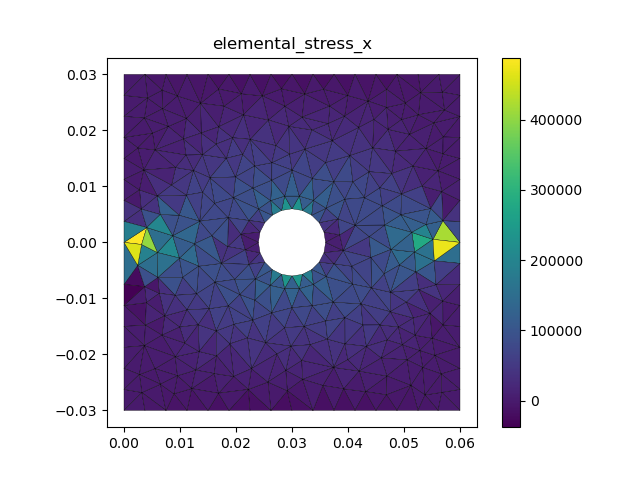

# PyTorch-Based Finite Element Analysis Framework

Introducing a framework designed for Finite Element Analysis (FEA) with PyTorch at its core. Our solution is specifically engineered to exploit the computational power of contemporary GPUs, enabling high-speed FEA computations.

## Key Features

- Element types supported:
    - T3 (triangular element with 3 nodes)
    - ... 

- Material models supported:
    - Linear Elasticity
    - ... 

- Solution methods:
    - Direct stiffness method for assembling global stiffness matrix and load vector
    - GPU-accelerated computation of element stiffness matrices

- Post-processing:
    - Computation of elemental strains and stresses
    - Visualization of attribute distribution in the domain (e.g., displacement, strains, stresses)

## Modules Overview

- **`element.py`**: Centers around the `TriangularElement` class, specialized in triangular element computations.
- **`material.py`**: A hub for material properties, it provides the `Material` class for elasticity stiffness matrix calculations and the `Elasticity_2D` class for 2D elasticity modeling.
- **`fem_module.py`**: The framework's core, it integrates nodes, elements, and material properties via the `FiniteElementModel` class.
- **`main.py`**: The primary execution script. Users can customize runs via command-line arguments.

## Getting Started

1. **Setup**: Craft nodes, elements, and material properties using the provided YAML templates in `geometry.yaml` and `material.yaml`.
2. **Execution**:
```bash
   python main.py --device cuda --geometry_path geometry.yaml --material_path material.yaml --loading_path loading.yaml
```

## Example

This script showcases the execution of a Finite Element Model using PyTorch. The model reads data from YAML files, computes element stiffness, assembles the global stiffness matrix, and solves the system to get displacements. 

```python
import torch
from pathlib import Path
from utlis.fem_module import FiniteElementModel 
from utlis.element import *
import argparse
import time

def main(args):
    print("Initializing the Finite Element Model...")
    start_time = time.time()

    # Initialize the model
    model = FiniteElementModel()

    print(f"Reading geometry data from {args.geometry_path}...")
    model.read_geom_from_yaml(args.geometry_path)

    print(f"Reading material data from {args.material_path}...")
    model.read_material_from_yaml(args.material_path)

    print(f"Reading loading data from {args.loading_path}...")
    model.read_loading_from_yaml(args.loading_path)

    # Move the model data to GPU if available and desired
    if args.device == "cuda" and torch.cuda.is_available():
        device = torch.device("cuda")
        model.to_device(device)
    else:
        device = torch.device("cpu")
        model.to_device(device)

    print(f"Compute the element stiffness...")
    model.compute_element_stiffness(material=model.material, ElementClass=eval(model.element_type))
  
    print(f"Assemble the element stiffness...")
    model.assemble_global_stiffness()
    assemble_end_time = time.time()

    model.assemble_global_load_vector(ElementClass=eval(model.element_type))
    model.solve_system()

    model.compute_elemental_strains_stresses(ElementClass=eval(model.element_type))
    model.save_results_to_file(file_path=Path('output.opt'))

    def elemental_strain_x():
        return model.elemental_strains[:, 0]
    
    def elemental_stress_x():
        return model.elemental_stresses[:, 0]

    model.plot([elemental_strain_x])
    model.plot([elemental_stress_x])

    total_time = assemble_end_time - start_time  
    print(f"Finite Element Model execution completed in {total_time:.2f} seconds.")

if __name__ == "__main__":
    parser = argparse.ArgumentParser(description='Finite Element Model Execution')
    parser.add_argument('--device', type=str, choices=['cpu', 'cuda'], default='cuda',
                        help='Device to run the FEM: "cpu" or "cuda". Default is "cpu".')
    parser.add_argument('--geometry_path', type=Path, default='geometry.yaml',
                        help='Path to the geometry.yaml file. Default is "geometry.yaml".')
    parser.add_argument('--material_path', type=Path, default='material.yaml',
                        help='Path to the material.yaml file. Default is "material.yaml".')
    parser.add_argument('--loading_path', type=Path, default='loading.yaml',
                        help='Path to the loading.yaml file. Default is "loading.yaml".')

    args = parser.parse_args()
    main(args)
   ```
   After executing the model, we can view the results through plots. Two examples of the results are shown below:

   - strain distribution
<div style="text-align: center">
    
</div>

   - stress distribution
<div style="text-align: center">
    
</div>
## Prerequisites

- Python (version 3.8 or higher)
- Pytorch (version 2.0.1 or higher)
- CUDA Toolkit (version 11.8 or higher)

## Roadmap

- **Element Expansion**: Our upcoming releases aim to support an extended array of element types.
- **Material Models**: We are working towards introducing a diverse set of material models to cater to a broad spectrum of engineering challenges.

## Contact

Should you have any inquiries, suggestions, or feedback, please don't hesitate to reach out:
- **Email**: [berrya90239@gmail.com](mailto:berrya90239@gmail.com)
- **GitHub**: [BerryWei's GitHub](https://github.com/BerryWei)
