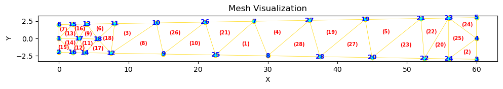
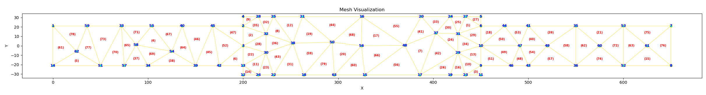
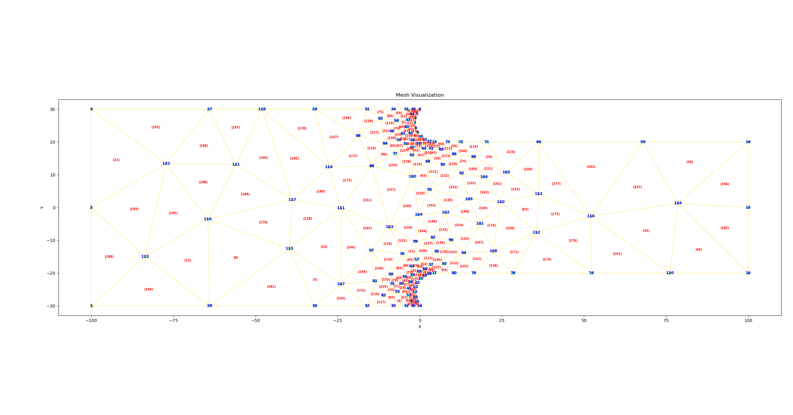

# Finite Element Method Mesh Generator

This repository provides a set of Python tools for generating meshes suitable for Finite Element Method (FEM) simulations. The primary objective is to facilitate the creation of polygonal meshes, with or without holes, and offer visualization capabilities.

## Features
- **Mesh Generation**: Create simple polygonal meshes or meshes with holes.
- **Visualization**: Visualize the generated mesh using `matplotlib`.
- **Export Options**: Save the mesh data in YAML and MATLAB formats.

## Mesh Construction

The framework utilizes the [Triangle](https://www.cs.cmu.edu/~quake/triangle.html) library for mesh generation. Triangle is a robust implementation of the Delaunay triangulation and constrained Delaunay triangulation algorithms. 

To construct the mesh, boundary vertices are first defined, and segments are created between consecutive vertices. The `triangle.triangulate()` function is then invoked with specific meshing options to produce the desired mesh. 

For ensuring particular points, such as `(0,0)`, are included in the mesh vertices, they can be explicitly added to the boundary vertices before triangulation.

## Usage
### Setup
1. Clone the repository to your local machine.
2. Ensure you have the required Python libraries installed.
3. Define your geometry in a YAML file.

### Execution
Run the `main.py` script:
```bash
python main.py
```


## Directory Structure

- `utlis/`:
  - `Geometry.py`: Contains the `Geometry` class for loading boundary and hole data from a YAML file.
  - `MeshGenerator.py`: Contains the `MeshGenerator` class for generating the mesh.
  - `Visualizer.py`: Contains the `Visualizer` class for visualizing the generated mesh.
- `main.py`: The main entry point for mesh generation.

## Example

### Example 1: Simple Polygon
```yaml
geometry:
  boundary:
    - [0.0, -2.0]
    - [0.0, -2.0]
    - [60.0, -3.0]
    - [60.0, 3.0]
    - [0.0, 2.0]
  holes:
    # if no holes--> leave empty
    # - center: [0.5, 0.5]
    #   radius: 0.3

mesh:
  area: 100

num-dim: 2
```

<div style="text-align: center">
    
</div>

### Example 2: Complex Polygon
```yaml
geometry:
  boundary:
    - [0.0, 21]
    - [200, 21]
    - [200, 0]
    - [200, 31.]
    - [450, 31]
    - [450, 21]
    - [650, 21]
    - [650, -21]
    - [450, -21]
    - [450, 0]
    - [450, -31]
    - [200, -31]
    - [200, -21]
    - [0, -21]
    
  holes:
    # if no holes--> leave empty
    # - center: [0.5, 0.5]
    #   radius: 0.3

mesh:
  area: 1000

num-dim: 2
```

<div style="text-align: center">
    
</div>

### Example 3: Polygon with a Hole
```yaml
geometry:
  boundary:
    - [0.0, -30]
    - [200.0, -30]
    - [200.0, 30]
    - [0.0, 30.]
  holes:
    # if no holes--> leave empty
    - center: [100, 0]
      radius: 12

mesh:
  area: 50

num-dim: 2
```

<div style="text-align: center">
    
</div>

### Example 4: Irregular shape
```yaml
geometry:
  boundary:
  - [-100, -30.0]
  - [-100, 0.0]
  - [-100, 30.0]
  - [1.7763568394002505e-15, 30.0]
  - [-0.8660498191297741, 28.73930148776709]
  - [-1.3852060837090914, 27.300593803451388]
  - [-1.523732245478456, 25.77736908908176]
  - [-1.2726264010407817, 24.268611692132122]
  - [-0.648206266307632, 22.872365824349224]
  - [0.30895120444559065, 21.679364313812755]
  - [1.5366466477378982, 20.767132475692478]
  - [2.9551002180845165, 20.19495025233008]
  - [4.472135954999579, 20.0]
  - [100, 20.0]
  - [100, 0.0]
  - [100, -20.0]
  - [4.47213595499958, -20.0]
  - [2.955100218084515, -20.19495025233008]
  - [1.536646647737899, -20.767132475692478]
  - [0.3089512044455933, -21.679364313812755]
  - [-0.648206266307632, -22.87236582434922]
  - [-1.2726264010407817, -24.268611692132122]
  - [-1.523732245478456, -25.777369089081756]
  - [-1.3852060837090914, -27.300593803451388]
  - [-0.866049819129775, -28.739301487767086]
  - [0.0, -30.0]
  holes:
    # if no holes--> leave empty
    # - center: [100, 0]
    #   radius: 12

mesh:
  area: 500

num-dim: 2
```

<div style="text-align: center">
    
</div>


